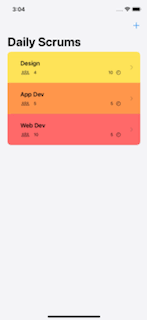

# ReadMe

This code is from this [official tutorial from Apple on how to use SwiftUI](https://developer.apple.com/tutorials/app-dev-training/getting-started-with-scrumdinger). The functional purpose of this app is to create an interface for teams to use during scrum meetings. 

## Here is what my app looks like so far on 08/12:

 I am halfway through the tutorial and will upload a finished gif when completed. 
